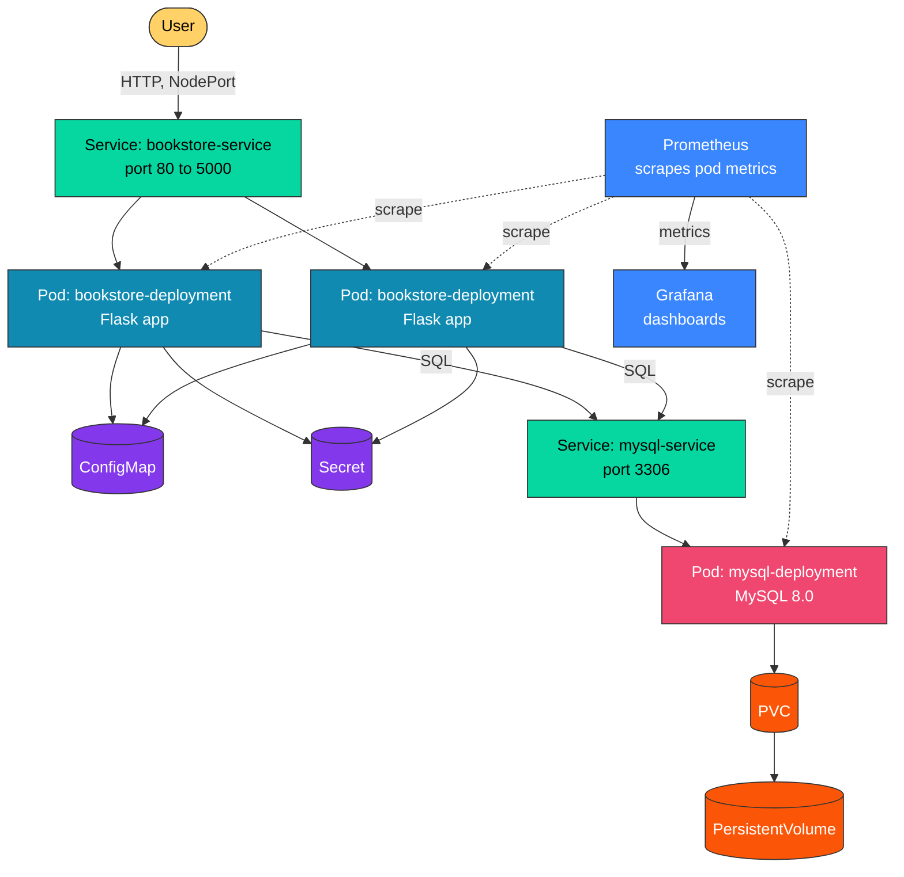

# 📚 Online Book Store

A Flask + MySQL web app for managing a book catalog (add, edit, delete, search), containerized with Docker, deployed on Kubernetes, and shipped through a GitHub Actions CI/CD pipeline. Cluster health is tracked with **Prometheus** and **Grafana**.

Built as a hands-on DevOps project covering the full lifecycle: code → container → cluster → automated deployment → monitoring.

---

## 🧰 Tech Stack

| Layer | Technology |
|---|---|
| Backend | Python, Flask |
| Database | MySQL 8.0 |
| Frontend | HTML, CSS (Jinja2) |
| Containerization | Docker, Docker Compose |
| Orchestration | Kubernetes |
| CI/CD | GitHub Actions, Docker Hub |
| Monitoring | Prometheus, Grafana |

---

## 🏗️ Architecture



The Flask app runs as 2 replicas behind a `bookstore-service` (`NodePort`), reachable directly on the node's IP and port — no Ingress is used in this setup. Config comes from a `ConfigMap` and `Secret`. MySQL runs as a single pod backed by a `PersistentVolume` so data survives restarts. Liveness/readiness probes hit `/health`. Prometheus scrapes metrics from the running pods, and Grafana visualizes them (pod count, CPU, memory).

---

## 🛠️ How This Project Was Built


### 1. Build the Flask app
Started with the core app — routes to list, search, add, edit, and delete books — plus a `/health` route that Kubernetes uses later to check if the app is alive.
```python
@app.route("/health")
def health():
    return {"status": "healthy"}, 200
```

### 2. Connect MySQL
Used `PyMySQL` to connect to the database. Since the app and MySQL can start at the same time, the app retries the connection instead of crashing:
```python
for _ in range(30):
    try:
        return pymysql.connect(host=host, user=user, password=password, database=database)
    except pymysql.MySQLError:
        time.sleep(2)
```

### 3. Containerize with Docker
```bash
docker build -t online-book-store .
docker compose up --build
```
`docker-compose.yml` runs the app and MySQL together locally with one command.

### 4. Write Kubernetes manifests
Split the setup into separate files instead of one big config:
- `Namespace` — groups all resources
- `Deployment` — runs 2 replicas with CPU/memory limits and `/health` probes
- `Service` (`NodePort`) — exposes the app
- `ConfigMap` / `Secret` — app config and DB password
- `PV` / `PVC` — persistent storage for MySQL

### 5. Push the image and deploy
```bash
docker tag online-book-store <dockerhub-user>/online-book-store:latest
docker push <dockerhub-user>/online-book-store:latest

kubectl apply -f kubernetes/namespace.yml
kubectl apply -f kubernetes/
```

### 6. Automate with CI/CD
A GitHub Actions workflow runs on every push to `main`:
```bash
docker build -t $DOCKER_USERNAME/online-book-store:$GITHUB_SHA .
docker push $DOCKER_USERNAME/online-book-store:$GITHUB_SHA
kubectl set image deployment/bookstore-deployment bookstore=$DOCKER_USERNAME/online-book-store:$GITHUB_SHA
kubectl rollout status deployment/bookstore-deployment -n bookstore
```

### 7. Add monitoring
Deployed Prometheus to scrape pod metrics, and Grafana on top to visualize pod count, CPU, and memory usage.

---

## 🚀 Running the Project

### 1️⃣ Clone the repository
```bash
git clone https://github.com/<your-username>/online-book-store.git
cd online-book-store
```

### 2️⃣ Run locally with Docker Compose
```bash
docker compose up --build
```
App runs at `http://localhost:5001`.

### 3️⃣ Deploy to Kubernetes
```bash
kubectl apply -f kubernetes/namespace.yml
kubectl apply -f kubernetes/
```

### 4️⃣ Check pod and service status
```bash
kubectl get pods -n bookstore
kubectl get svc -n bookstore
```
Since the service is `NodePort`, access the app at `http://<node-ip>:<node-port>`.

If you're using **Minikube**, the easiest way is:
```bash
minikube service bookstore-service -n bookstore
```
This opens the app directly in your browser.

### 🔧 Environment Variables
| Variable | Default |
|---|---|
| `DB_HOST` | `localhost` |
| `DB_USER` | `root` |
| `DB_PASSWORD` | `root` |
| `DB_NAME` | `bookstore` |
| `PORT` | `5000` |

---

## 🖼️ Screenshots

**Website**


**CI/CD Pipeline — Successful Run**


## 📊 Monitoring (Prometheus + Grafana)

**Pod Count**

<!-- Paste your pod count / Grafana panel screenshot here -->


**CPU Usage**

<!-- Paste your Grafana CPU usage graph here -->


**Memory Usage**

<!-- Paste your Grafana memory usage graph here -->


Resource limits per pod (from `kubernetes/deployment.yml`):

| Resource | Request | Limit |
|---|---|---|
| CPU | 200m | 500m |
| Memory | 256Mi | 512Mi |

---

## 👤 Author

**Nisha Shakoor** — self-directed DevOps learning project
